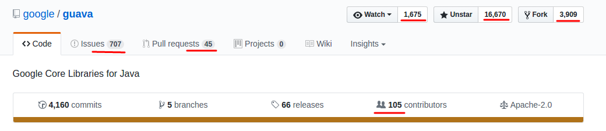
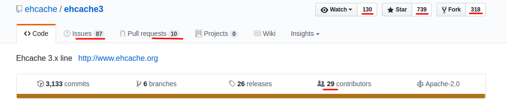

### Guava cache vs EhCache

---

*_Linux_*

*_Intel(R) Core(TM) i7-3770 CPU @ 3.40GHz(8 CPUs)_*

*_16 Gb RAM_*

#### 1. Time execution

| Operation     |    EhCache    |   Guava cache  |                                            
| ------------- |:-------------:| --------------:| 
| put 100       |   194.16 μs   |   352.42 μs    |
| put 10_000    |   4.505 ms    |   2.469 ms     |
| put 1_000_000 |   579.31 ms   |   352.65 ms    |
|				|				|				 |
| get 100		|	99.85 μs	|	264.43 μs    |
| get 10_000    |   4.07 ms     |   2.89 ms      |
| get 1_000_000 |   408.88 ms   |   296.34 ms    |

> **Guava cache loses only when small number of elements**
> **but when number of elements more then 1000**
> **time execution of Guava cache implementation is better almost half.**

#### 2. Thread safe

Both are `thread-safe` caches

#### 3. Docs

`Guava cache` - https://github.com/google/guava/wiki/CachesExplained

`EhCache` -     http://www.ehcache.org/documentation/

> **Documentation for EhCache obviously better than in Guava cache.**
> **Google provide us only wiki on github with examples**
> **but EhCache provides us full documentation with explanation and a lot of examples**

#### 4. Community

https://github.com/google/guava

https://github.com/ehcache/ehcache3

> **Both guava cache and ehcache are now being developed** 
> **it can be seen by stars and numbers who watched projects**
> **of course guava has better statistic because there are a lot of direction except the cache**

#### 5. Features

| Feature                |    EhCache    |   Guava cache  | 
| -----------------------|:-------------:| --------------:|
| Generics               |      no       |      yes       |
| Transformation asMap   |      no       |      yes       |
| Cache Manager          |      yes      |      no        |
| CacheLoader            |      yes      |      yes       |
| Extensions             |      yes      |      yes       |
| Eviction by Size       |      yes      |      yes       |
| Eviction by Time       |      yes      |      yes       | 
| Statistics             |      yes      |      yes       |

[***All tests are here***](src/test/java/com/investigation/caches/)